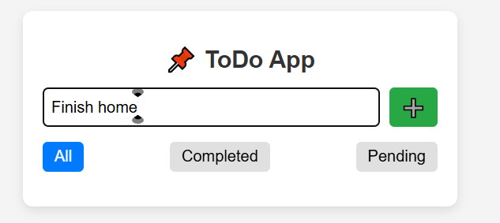
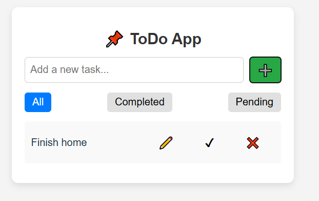
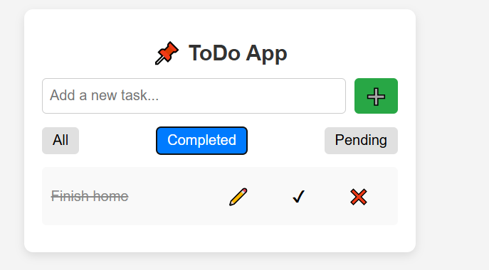

# Документация по ToDo-приложению на Zustand

## Описание

ToDo-приложение, разработанное на React с использованием Zustand для управления состоянием, включает функции:

- Добавление задач

- Удаление задач

- Отметка задач как выполненных

- Редактирование задач

- Фильтрация задач (все, выполненные, невыполненные)

- Сохранение данных после перезагрузки с помощью persist

